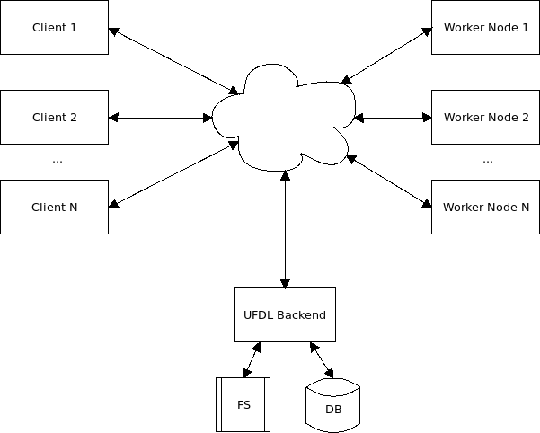

.. title: Architecture
.. slug: architecture
.. date: 2020-09-15 15:14:32 UTC+12:00
.. tags:
.. category:
.. link:
.. description:
.. type: text

.. contents::

The User-friendly Deep Learning architecture is comprised of three components:

* backend
* worker node(s)
* client(s)

Backend
=======

The backend provides the `REST API <API_>`__ for managing datasets,
job templates, jobs (and their output) and in general the configuration of the system.

By default, the backend stores data files on disk. But thanks to abstraction, the storage
system can be easily swapped out.

All other system related information (job templates, etc) is stored in a database.
Currently, only PostgreSQL is supported.

Worker Node(s)
==============

Nodes can be dynamically added to the pool of available workers, by simply starting up the `job-launcher <JobLauncher_>`__.
A worker node polls for available jobs using its hardware environment (GPU? Hardware generation? etc) to only
attempt to execute jobs that will succeed.

Each job execution will result in a log file being stored back in the backend. This log can be used to determine
potential error causes in case a job terminates unexpectedly.

Client(s)
=========

At the time of writing, three low-level client libraries are available that fully encapsulate the `REST API <API_>`__:

* `Python <PythonClient_>`__
* `Java <JavaClient_>`__
* `TypeScript <TypeScriptClient_>`__

These client libraries can be used to build user-facing applications:

* `UFDL ADAMS Frontend <ADAMSFrontend_>`__
* `UFDL HTML Frontend <HTMLFrontend_>`__

.. _API: https://waikato-ufdl.github.io/ufdl-api/
.. _PythonClient: https://github.com/waikato-ufdl/ufdl-python-client
.. _JavaClient: https://github.com/waikato-ufdl/ufdl-java-client
.. _TypeScriptClient: https://github.com/waikato-ufdl/ufdl-ts-client
.. _ADAMSFrontend: https://github.com/waikato-ufdl/ufdl-frontend-adams
.. _HTMLFrontend: https://github.com/waikato-ufdl/ufdl-frontend-ts
.. _JobLauncher: https://github.com/waikato-ufdl/ufdl-job-launcher
